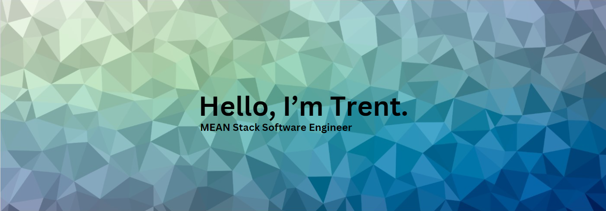

</img>
 
👨‍💻 About Me
- 💻 Dedicated engineer and stat enthusiast with a passion for designing and creating modern intuitive UI's. I also enjoy creating 3D models on the side.
- 🌱 Currently learning: 

- 💬 In my spare time, I enjoy playing video games, working out, and spending time with friends & family

✔ Languages & Frameworks
 

🛠 Current Support and DBs
 

⏳ In A Past Career
 

